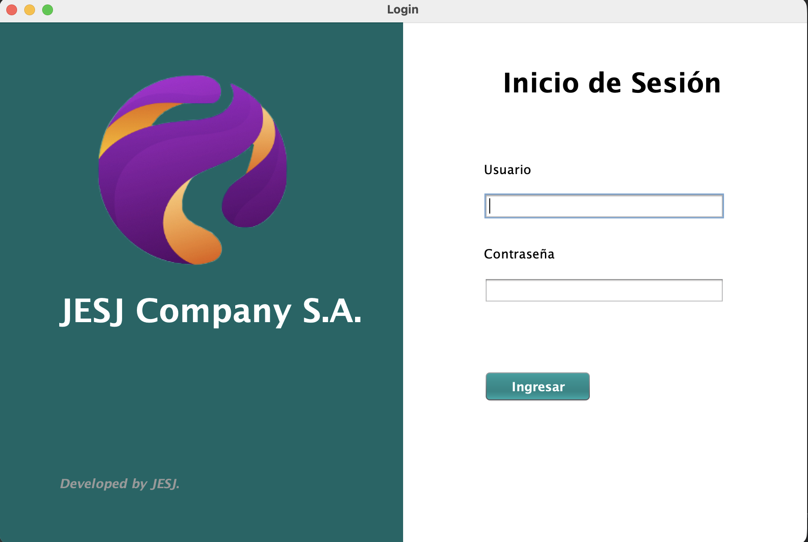
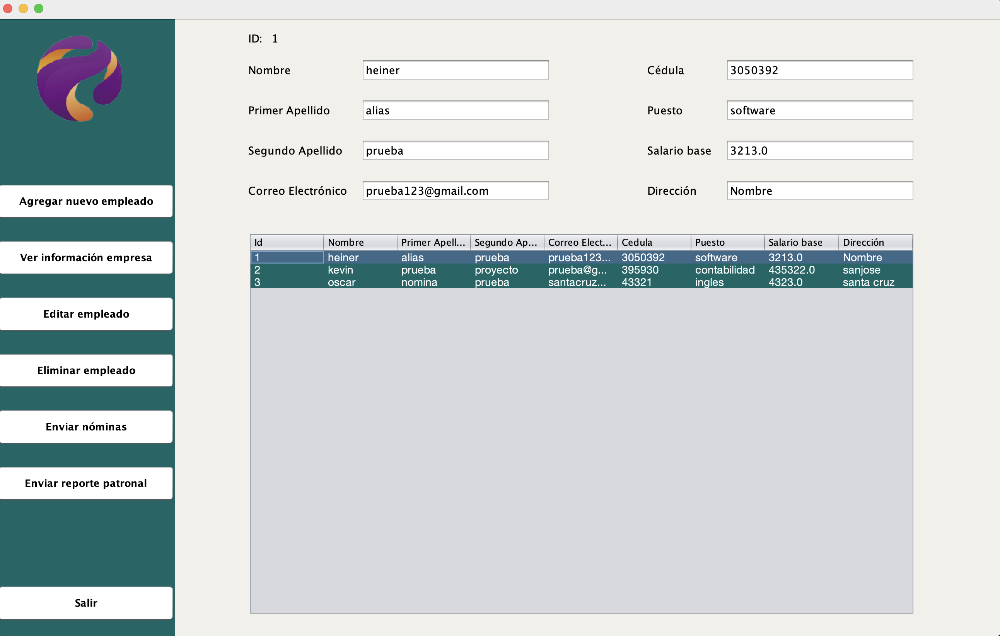
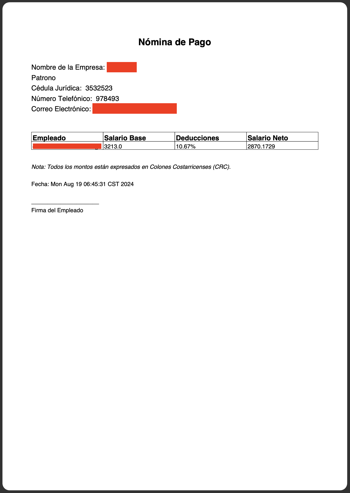
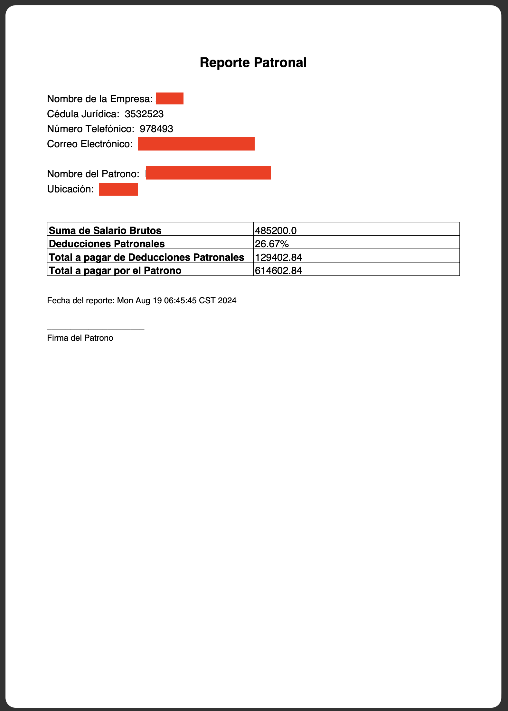

# 💼 Sistema de Cálculo de Nóminas CR

**Sistema de Cálculo de Nóminas CR** es una aplicación de escritorio desarrollada en **Java (Maven, NetBeans)** que permite gestionar el cálculo de salarios, deducciones y aportes patronales según la legislación laboral costarricense.
Incluye generación de **reportes en PDF** y envío automático por **correo electrónico** a cada empleado.

---

## 🚀 Características principales

* 🧮 **Cálculo completo de planilla**

  * Salario bruto, deducciones, salario neto y aportes patronales.
  * Totales globales por empleado y por patrono.

* 📊 **Generación de reportes**

  * Reportes en formato **PDF** generados con la biblioteca **iText**.
  * Detalle mensual de gastos patronales y netos a pagar.

* ✉️ **Envío de comprobantes por correo**

  * Envío automático de reportes PDF a cada empleado mediante **JavaMail**.

* 🧱 **Arquitectura por capas**

  * **Entidades** → representación de datos.
  * **Acceso a Datos** → lectura y escritura de la información.
  * **Lógica de Negocio** → cálculos y validaciones.
  * **Presentación (JForm)** → interfaz gráfica.

---

## 🧰 Tecnologías utilizadas

* **Lenguaje:** Java
* **Framework:** Maven
* **IDE:** NetBeans
* **Bibliotecas:**

  * iText (generación de PDF)
  * JavaMail (envío de correos)
* **Patrón de diseño:** Modelo en capas (Presentación, Lógica, Acceso a Datos, Entidades)

---

## 📷 Vistas de la aplicación

| Login         | Inicio      |
| ------------------------- | ------------------- |
|  |  |

| PDF - Empleado          | PDF - Patronal        |
| ------------------------- | ------------------------- |
|  |  |


## ⚙️ Ejecución

1. Clona el repositorio:

   ```bash
   git clone https://github.com/EstebannHM/SistemaNominasCR.git
   ```
2. Abre el proyecto en **NetBeans**.
3. Ejecuta con **Maven → Clean and Build**.
4. Inicia la aplicación desde la clase principal.
5. Crea un config.txt -> Coloca credenciales de envío de correo electrónico.

---
